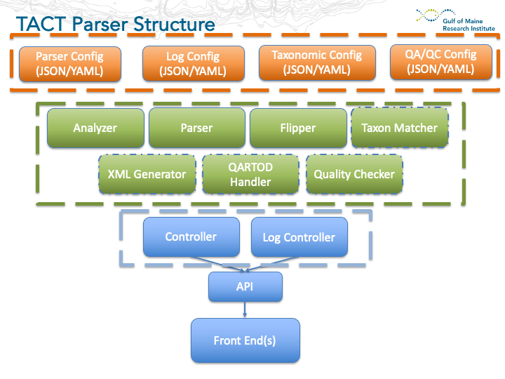

# TACT
An extensible framework and GUI for processing data files. TACT is a DMAC tool to help organize Python scripts by placing their functionality behind a control layer and an API, which users can access via the command line, or a GUI. 

The goal of this project is to collect a wide array of processing scripts into a tool which is useful to both technical and non-technical users. 

## Quick Start
1. Clone this repo locally
2. Use Conda/Mamba to create a new environment from the `tact/environment.yml` file
3. Activate the new `tact` environment
4. Using VScode, add the following configs to your `launch.json` file: 
```JSON
        {
            "name": "TACT API",
            "type": "python",
            "request": "launch",
            "env": {
                "PYTHONPATH": "${workspaceRoot}"
            },
            "program": "API/tact_api.py",
            "console": "integratedTerminal"
        },
        {
            "name": "Steamlit GUI",
            "type": "python",
            "request": "launch",
            "module": "streamlit",
            "args": [
                "run",
                "UI/streamlit/TACT.py"
            ],
            "env": {
                "API_URL": "http://127.0.0.1:5000"
            }
        }
```
**Note**: You may need to provide absolute paths to the program files

5. Launch `TACT API` from the Run and Debug menu
6. Launch `Steamlit GUI` from the Run and Debug menu
7. TACT should open in a new browser window

## Structure
TACT is config-driven, and the basic workflow is as follows:

1. Application starts up, reads config files
2. User modifies config files via the [API](https://github.com/Dylan-Pugh/TACT/blob/docs/tact/TACT.postman_collection.json) (e.g. by providing a file path to the target file)
3. Config changes are saved
4. User initiates specific operations via API
5. Repeat

Diagram of TACT structure:



## Functionality

### Current   
1. Dataset cleaning (for tabular data)
    1. Standardize datetime formats
    2. Delete columns
    3. Normalize column headers
    4. Batch replace row values
    5. Drop duplicate rows
    6. Drop empty columns
2. Dataset transformation
    1. Row enumeration (flipping from wide to long)
    2. Append constant values to transformed rows
    3. Drop records with value of `0` in target columns
    4. Split input column into multiple columns
    5. Set occurrence status for each row
    6. Generate UUID for each record
    7. Row combination (find records that share 1 - n column values and combine them into a single row)

### In-process (various levels of progress)
1. Conditional Append (append values to all records that match a given criteria)
2. Taxonomic name matching 
3. ERDDAP `datasets.xml` generation
4. IOOS QARTOD testing
5. Ad-hoc dataset QA/QC

## Tech Stack
- API: [Flask](https://flask.palletsprojects.com/en/3.0.x/)
- GUI: [Streamlit](https://docs.streamlit.io/)
- Dataset operations: [Pandas](https://pandas.pydata.org/docs/)
- Package management: [Micromamba](https://mamba.readthedocs.io/en/latest/user_guide/micromamba.html)

## Future Plans/Things That Need Help!
- Improve documentation (add local development steps)
- CI/CD steps
- Testing
- Move to a different GUI framework
- Complete in-process functionality
- Add new functionality! 

## Contributing
TACT started as a purely internal tool, and is still a **work in progress**! Please feel free to open issues and PRs with improvements/fixes.
